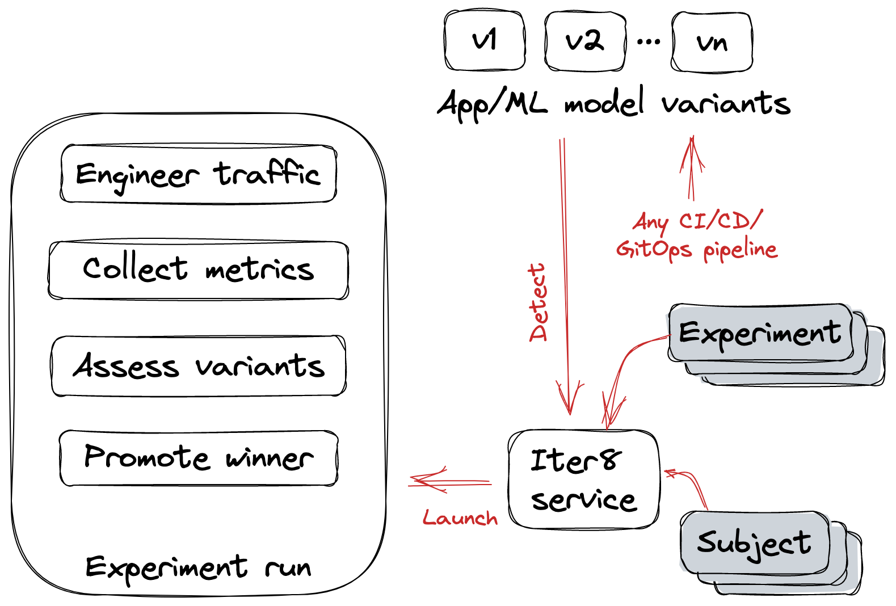

# Iter8

## What is Iter8?
Iter8 is the Kubernetes release optimizer built for DevOps, MLOps, SRE and data science teams. Iter8 makes it easy to ensure that Kubernetes apps and ML models perform well and maximize business value.

## What is an Iter8 experiment?
Iter8 introduces the notion of an *experiment* to facilitate various release optimization use-cases, as illustrated in the picture below.

<!-- {: style="width:80%"} -->

## Use-cases

1.  A/B/n testing with traffic splitting, user stickiness, and business metrics collection and assessment.
2.  Performance testing and service-level objective (SLO) validation of HTTP and gRPC services.
3.  Canary testing with traffic splitting and SLO validation with metrics from any DB (e.g., Prometheus).
4.  Traffic mirroring and SLO validation with metrics from any DB (e.g., Prometheus).

## How it works
A brief overview of how Iter8 works for the various use-cases is presented below.

=== "A/B/n testing"
    The following picture illustrates A/B/n testing of a `backend` in a distributed Kubernetes app.
    
    - **The frontend** uses the Iter8 SDK to lookup backend versions, split traffic between backend versions, and push business metrics. 
    - **Iter8 experiment** fetches metrics and assesses versions. 
    - **Iter8 service** tracks available versions, and responds to the Iter8 SDK requests made by the frontend, and metrics requests made by the Iter8 experiment.

    {: style="width:80%"}

=== "Performance testing"
    **Iter8 experiment** checks if the app is ready, generates load, collects metrics, and validates service-level objectives (SLOs).
    === "HTTP"

        

    === "gRPC"

        

=== "Canary testing"
    - **Iter8 experiment** checks if the app is ready, fetches metrics from a database (e.g., Prometheus), and validates service-level objectives (SLOs). 
    - **Service mesh (e.g., Istio)** handles traffic splitting.

    

=== "Traffic mirroring"
    - **Iter8 experiment** checks if the app is ready, fetches metrics from a database (e.g., Prometheus), and validates service-level objectives (SLOs).
    - **Service mesh (e.g., Istio)** handles traffic mirroring.
    
    

## Features

* Flexible: Iter8 is designed to work with any Kubernetes resource type (including custom resources), any service mesh, any CI/CD platform, and any metrics database
* Automated experiments with Iter8 AutoX controller
* Manual experiments with Iter8 CLI
* Rich text/HTML experiment reports with metrics-based version assessment
* Simple declarative experiment specification
* Single and multi-loop experiments
* GitHub action
* GitHub and Slack notifications

## Development Status
Iter8 is being actively developed by the community builds on a few awesome open source projects including:

- [Helm](https://helm.sh)
- [Fortio](https://github.com/fortio/fortio)
- [ghz](https://ghz.sh)
- [plotly.js](https://github.com/plotly/plotly.js)

Iter8 releases can be found [here](https://github.com/iter8-tools/iter8).