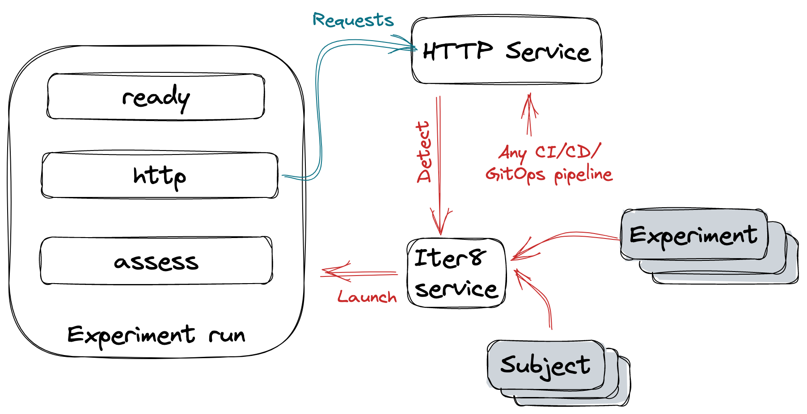

# Your First Experiment

> Deploy an app. Iter8 will detect the app and run a performance testing experiment for it. Whenever the app gets updated, Iter8 will re-run the experiment.



???+ warning "Before you begin"
    1. Get access to a Kubernetes cluster. For learning and local development, you can use [Kind](https://kind.sigs.k8s.io/) or [Minikube](https://minikube.sigs.k8s.io/docs/).
    2. [Install Iter8 CLI](install.md#install-iter8-cli).
    ```shell
    go install github.com/iter8-tools/iter8@v0.14
    ```
    3. [Install Iter8 service](install.md#install-iter8-service) such that it can manage apps in the `default` namespace. For example:
    ```shell
    helm upgrade --install iter8-service iter8-service \
    --repo https://iter8-tools.github.io/iter8 --version 0.14.x \
    --set "appNamespaces=*" -n iter8-system
    ```
    The above command installs Iter8 service in the `iter8-system` namespace. The service can manage apps in all namespaces.

***

## Deploy application

Deploy an application.

```shell
kubectl create deploy httpbin --image=kennethreitz/httpbin --port=80
kubectl expose deploy httpbin --port=80
```

Label the app resources so that Iter8 can detect them.
```shell
kubectl label deploy httpbin iter8.tools/detect=true
kubectl label svc httpbin iter8.tools/detect=true
```

***

## Create Iter8 specs

Create the Iter8 specs needed to performance test the app.

=== "subject"

    A `subject` in Iter8 is an [immutable configmap](https://kubernetes.io/docs/concepts/configuration/configmap/) that specifies an app and its versions (variants). Create it as follows.

    ```shell
    cat << EOF | kubectl apply -f -
    apiVersion: v1
    kind: ConfigMap
    metadata:
      # httpbin is the name of the subject
      name: httpbin
      labels:
        # standard Iter8 labels applied on subjects
        app.kubernetes.io/managed-by: iter8
        app.kubernetes.io/component: subject
    data:
      spec: |
        # each variant of httpbin has a service and deployment resource
        gvrs: [svc, deploy]
        # httpbin has a single variant
        variants:
        # the variant has a service named httpbin and a deployment named httpbin
        - [httpbin, httpbin]
    immutable: true
    EOF
    ```

=== "experimentspec"

    An `experimentspec` in Iter8 is a special type of [immutable secret](https://kubernetes.io/docs/concepts/configuration/secret/) that specifies an Iter8 experiment for a subject. Iter8 can launch new runs of the experiment whenever it detects changes to the app defined by the subject. Create the `experimentspec` as follows.

    ```shell
    cat << EOF | kubectl apply -f -
    apiVersion: v1
    kind: Secret
    metadata:
      // name of the experimentspec
      name: performance-test
      labels:
        # standard Iter8 labels applied on experimentspecs
        app.kubernetes.io/managed-by: iter8   
        app.kubernetes.io/component: iter8/experimentspec
    stringData:
      spec: |
        # this experimentspec is for httpbin
        subject: httpbin
        trigger:
          # trigger a new run of the experiment whenever there is a change to
          # the signature of variant 1
          # older runs will be garbage collected automatically
          owner: variant/1/sig
        tasks:
        # check if Kubernetes resources involved in the experiment are ready
        - name: ready
          svc: httpbin
          deploy: httpbin
        # generate requests for HTTP service and collect metrics
        - name: http
          url: http://httpbin.default/get
        # assess httpbin variant using metrics and service-level objectives (SLOs)
        - name: assess
          SLOs:
            upper: 
              http/latency-mean: 50
              http/error-count: 0
    immutable: true
    EOF
    ```

***

## Watch experiment events
Iter8 will run the `performance-test` experiment. Watch the events related to this experiment as follows.
```shell
kubectl get events -w --field-selector='source=httpbin/performance-test'
```

In ~1 min, you should observe an event that indicates that the experiment has completed.

***

## View experiment report
Create the experiment report as follows.

```shell
iter8 report -s httpbin -e performance-test -o html > report.html # view in a browser
```

??? note "Sample report"    
    
        
***

Congratulations :tada: You completed your first Iter8 experiment.

***

## Trigger experiment re-run

Update the sample app.

```shell
kubectl set env deploy/httpbin IMPROVE=everything
```

The above changes variant 1 of `httpbin`. As a result, Iter8 will re-run the `performance-test` experiment. Watch events and view report for the second experiment in the same manner as the first.

***

Congratulations :tada: You completed your second Iter8 experiment.

***


## Cleanup
Remove the sample app and Iter8 specs.

```shell
kubectl delete svc/httpbin deploy/httpbin cm/httpbin secret/httpbin-performance-test
```

