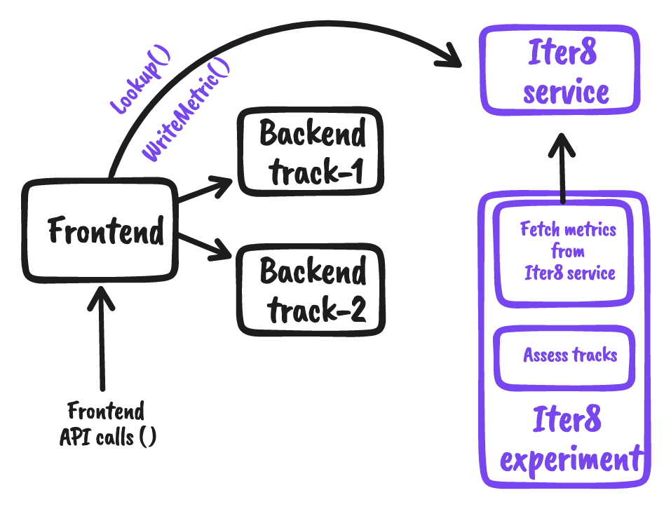

# A/B testing an upstream (backend) service

This tutorial describes the process of [A/B testing]((../../user-guide/topics/ab_testing.md) [an upstream service](https://www.envoyproxy.io/docs/envoy/latest/intro/arch_overview/intro/terminology) in a distributed Kubernetes app. In this and other Iter8 tutorials, the terms `backend` and `upstream service` are used synonymously, and the terms `frontend` and `downstream service` are used synonymously. 

The process of A/B testing a backend involves the following steps.

1. Deploying a candidate version of the backend.
2. Splitting the traffic from the frontend to the stable and candidate versions, while ensuring [user stickiness](sticky).
3. Collecting business metrics for backend versions.
4. Promoting the winning version of the backend as the latest stable version.

Iter8 automates steps 2 and 3 while decoupling the frontend and backend components: the frontend code and configuration is unaffected even as candidate versions of the backend are deployed, A/B tested, promoted as the latest stable version, and/or deleted. 

Iter8 associates each version of the service that is being A/B tested with a [track number](tracks). The stable version is associated with Track 1, while the candidate version is associated with track 2. The following picture illustrates A/B testing of a backend in Iter8.




***
 
## Deploy Iter8 service

Configure and deploy the [Iter8 service](iter8service) as follows. This configuration provides information about the [persistent storage used by the Iter8 service](storage), and the backend that is A/B tested using Iter8.

```shell
cat << EOF > values.yaml
storageClassName: iter8
abn:
- name: recommender
  namespace: test
  tracks:
  - weight: 3
    resources:
    - name: recommender-stable
      type: svc
    - name: recommender-stable
      type: deploy
  - resources:
    - name: recommender-candidate
      type: svc
    - name: recommender-candidate
      type: deploy
EOF
```

```shell
helm install --repo https://iter8-tools.github.io/hub iter8-service iter8-service \
--version 0.14.x -f values.yaml --create-namespace -n iter8-system
```

??? note "Documentation for `values.yaml`"
    ```yaml
    # name of the Kubernetes storage class used by the Iter8 service
    storageClassName: iter8
    # this section specifies Iter8 configuration for A/B/n testing
    abn:
      # name of the service that is A/B testing using Iter8
      # choose a unique name
    - name: recommender
      # namespace of the service
      namespace: test
      # a service must always have a stable version; it may have multiple candidate versions
      # the current stable version is served by track 1; 
      # candidate versions are served by the other tracks
      tracks:
        # users are split across tracks in proportion to their weights
        # weights must be positive (default 1)
      - weight: 3
        # each track can have multiple resources associated with it
        resources:
          # name of the resource
        - name: recommender-stable
          # type of the resource
          # svc is shorthand for k8s service
          type: svc
        - name: recommender-stable
          # deploy is shorthand for k8s deployment
          type: deploy
        # second track with the default weight of 1
      - resources:
        - name: recommender-candidate
          type: svc
        - name: recommender-candidate
          type: deploy
    ```

## Deploy sample app
Deploy the sample application.
=== "Frontend"
    Deploy the frontend in the language of your choice:
    === "node"
        ```shell
        kubectl create deployment frontend --image=iter8/abn-sample-frontend-node:0.13
        kubectl expose deployment frontend --name=frontend --port=8090
        ```

    === "Go"
        ```shell
        kubectl create deployment frontend --image=iter8/abn-sample-frontend-go:0.13
        kubectl expose deployment frontend --name=frontend --port=8090
        ```
    
=== "Backend: stable version"
     Deploy the stable version of the backend as follows.

    ```shell
    kubectl create deployment recommender-stable --image=iter8/abn-sample-backend:0.13-v1
    kubectl expose deployment recommender-stable --port=8091
    ```

    > The resources created above are the same as the resources listed under Track 1 in the Iter8 service configuration.


## Generate load

Use [this script](https://raw.githubusercontent.com/iter8-tools/docs/main/samples/abn-sample/generate_load.sh) to generate load. The script simulates multiple users that make requests to the frontend. First, port-forward the frontend as follows.
```shell
kubectl port-forward service/frontend 8090:8090
```

In a separate terminal, run the load generation script.
```shell
curl -s https://raw.githubusercontent.com/iter8-tools/docs/main/samples/abn-sample/generate_load.sh | sh -s --
```

## Deploy candidate version
Deploy the candidate version of the backend. The candidate version is associated with Track 2.

```shell
kubectl create deployment recommender-candidate --image=iter8/abn-sample-backend:0.13-v2
kubectl expose deployment recommender-candidate --port=8091
```

> The resources created above are the same as the resources listed under Track 2 in the Iter8 service configuration.

??? note "Behind the scenes: traffic splitting, user stickiness, and metrics"
    ```mermaid
    sequenceDiagram
        actor U1 as User1
        actor U2 as User2
        participant F as Frontend
        participant B1 as Backend <br> track-1
        participant B2 as Backend <br> track-2
        participant I as Iter8 service
        U1->>F: List()
        activate F
        F->>I: Lookup()
        activate I
        I-->>F: Track 1
        deactivate I
        F->>B1: Rank()
        B1-->>F: Recommendations
        F-->>U1: Products
        deactivate F
        U2->>F: List()
        activate F
        F->>I: Lookup()
        activate I
        I-->>F: Track 2
        deactivate I
        F->>B2: Rank()
        B2-->>F: Recommendations
        F-->>U2: Products
        deactivate F
        U2->>F: Buy()
        activate F
        F->>I: WriteMetric()
        deactivate F
        U2->>F: List()
        activate F
        F->>I: Lookup()
        activate I
        I-->>F: Track 2
        deactivate I
        F->>B2: Rank()
        B2-->>F: Recommendations
        F-->>U2: Products
        deactivate F
    ```


## Launch experiment

```shell
iter8 k launch \
--set abnmetrics.name=recommender \
--set "tasks={abnmetrics}" \
--set runner=cronjob \
--set cronjobSchedule="*/1 * * * *"
```


## Inspect experiment report

Inspect the metrics:

```shell
iter8 k report
```

??? note "Sample output from report"
    ```
    Experiment summary:
    *******************

    Experiment completed: true
    No task failures: true
    Total number of tasks: 1
    Number of completed tasks: 1
    Number of completed loops: 3

    Latest observed values for metrics:
    ***********************************

    Metric                   | Track 1 | Track 2
    -------                  | -----        | -----
    abn/sample_metric/usercount  | 282        | 629
    abn/sample_metric/count  | 35.00        | 28.00
    abn/sample_metric/max    | 99.00        | 100.00
    abn/sample_metric/mean-per-count   | 56.31        | 52.79
    abn/sample_metric/mean-per-user   | 561.31        | 522.79
    abn/sample_metric/min    | 0.00         | 1.00
    abn/sample_metric/stddev-per-count | 28.52        | 31.91
    abn/sample_metric/stddev-per-user | 283.52        | 314.91
    ```
The output allows you to compare the versions against each other and select a winner. Since the experiment runs periodically, the values in the report will change over time.

Once a winner is identified, the experiment can be terminated, the winner can be promoted, and the candidate version(s) can be deleted.

To delete the experiment:

```shell
iter8 k delete
```

## Promote candidate version

Delete the candidate version:

```shell
kubectl delete deployment backend-candidate-1 
kubectl delete service backend-candidate-1
```

Update the version associated with the baseline track identifier *backend*:

```shell
kubectl set image deployment/backend abn-sample-backend=iter8/abn-sample-backend:0.13-v2
```

## Cleanup

### Delete sample sample

```shell
kubectl delete \
deploy/frontend deploy/backend deploy/backend-candidate-1 \
service/frontend service/backend service/backend-candidate-1
```

### Uninstall the A/B/n service

```shell
helm delete iter8-service -n iter8-system
```
