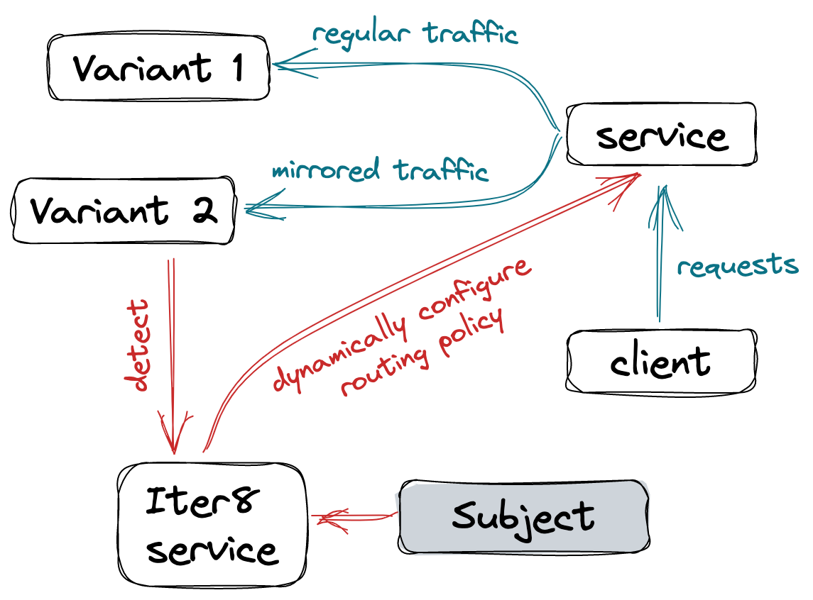

# Traffic mirroring

Deploy two variants of an app. Iter8 will detect the second variant and dynamically configure routing resources for the app so that requests to variant 1 are mirrored to variant 2. 

This tutorial builds on the [Istio traffic mirroring tutorial](https://istio.io/latest/docs/tasks/traffic-management/mirroring/).



***

???+ warning "Before you begin"
    Set up Istio by following the instructions in the [Istio installation guide](https://istio.io/latest/docs/setup/).

***

## Deploy app

Start by deploying variant 1 of `httpbin` with access logging enabled.

=== "httpbin-v1 deployment"

    ```shell
    cat << EOF | istioctl kube-inject -f - | kubectl create -f -
    apiVersion: apps/v1
    kind: Deployment
    metadata:
      name: httpbin-v1
      labels:
        iter8.tools/detect: true
    spec:
      replicas: 1
      selector:
        matchLabels:
          app: httpbin
          version: v1
      template:
        metadata:
          labels:
            app: httpbin
            version: v1
        spec:
          containers:
          - image: docker.io/kennethreitz/httpbin
            imagePullPolicy: IfNotPresent
            name: httpbin
            command: ["gunicorn", "--access-logfile", "-", "-b", "0.0.0.0:80", "httpbin:app"]
            ports:
            - containerPort: 80
    EOF
    ```

=== "httpbin-v1 service"

    ```shell
    cat << EOF | kubectl apply -f - 
    apiVersion: v1
    kind: Service
    metadata:
      name: httpbin-v1
      labels:
        iter8.tools/detect: true
    spec:
      ports:
      - port: 80
        name: http
      selector:
        app: httpbin
        version: v1
    EOF
    ```

=== "httpbin service"

    Create a service to which clients of `httpbin` will send requests.

    ```shell
    cat << EOF | kubectl create -f - 
    apiVersion: v1
    kind: Service
    metadata:
      name: httpbin
      labels:
        app: httpbin
    spec:
      ports:
      - name: http
        port: 8000
        targetPort: 80
      selector:
        app: httpbin
    EOF
    ```

=== "subject"

    Create the `subject`. Note that even though variant 2 of `httpbin` is yet to be created, the subject already specifies both the variants.

    ```shell
    cat << EOF | kubectl create -f - 
    apiVersion: v1
    kind: ConfigMap
    metadata:
      name: httpbin
      labels:
        app.kubernetes.io/managed-by: iter8    
        app.kubernetes.io/component: httpbin
    data:
      spec: |
        gvrs: [svc, deploy]
        variants: 
        - [httpbin-v1, httpbin-v1]
        - [httpbin-v2, httpbin-v2]
    immutable: true
    EOF
    ```

=== "routing policy"

    A `routingpolicy` in Iter8 is a special type of [immutable configmap](https://kubernetes.io/docs/concepts/configuration/configmap/). It references a Helm chart with Kubernetes resource templates that enable routing. Iter8 can dynamically configure routing resources using this policy, based on the state of the app.

    ```shell
    cat << EOF | kubectl apply -f -
    apiVersion: v1
    kind: ConfigMap
    metadata:
      // name of the routingpolicy
      name: httpbin-route
      labels:
        # standard Iter8 labels applied on routingpolicies
        app.kubernetes.io/managed-by: iter8   
        app.kubernetes.io/component: iter8/routingpolicy
    data:
      spec: |
        trigger:
          # routing resources are owned by httpbin
          owner: httpbin
          # routing resources are updated based on the state of variant 2
          update: variant/2
        repo: https://iter8-tools.github.io/iter8
        chart: mirror
        version: 0.14.x 
        values:
          parentRefs:
          - kind: Service
            name: httpbin
            port: 8000
          rules:
          # the filters section will be dynamically included in the routing resource
          # depending upon whether variant 2 exists or not
          # rest of the values will be included as they are
          - filters:
            - type: RequestMirror
              requestMirror:
                backendRef:
                  name: httpbin-v2
                  port: 80
            backendRefs:
            - name: httpbin-v1
              port: 80
    immutable: true
    EOF
    ```    

## Inspect routing resource

```shell
kubectl get httproute/httpbin -o yaml
```

??? note "Output will be similar to this"

    ```yaml
    apiVersion: gateway.networking.k8s.io/v1beta1
    kind: HTTPRoute
    metadata:
      name: httpbin
    spec:
      parentRefs:
      - kind: Service
        name: httpbin
        port: 8000
      rules:
      - backendRefs:
        - name: httpbin-v1
          port: 80
    ```

## Deploy variant 2

Deploy variant 2 of `httpbin` with access logging enabled.

=== "httpbin-v2 deployment"

    ```shell
    cat << EOF | istioctl kube-inject -f - | kubectl create -f -
    apiVersion: apps/v1
    kind: Deployment
    metadata:
      name: httpbin-v2
      labels:
        iter8.tools/detect: true
    spec:
      replicas: 1
      selector:
        matchLabels:
          app: httpbin
          version: v2
      template:
        metadata:
          labels:
            app: httpbin
            version: v2
        spec:
          containers:
          - image: docker.io/kennethreitz/httpbin
            imagePullPolicy: IfNotPresent
            name: httpbin
            command: ["gunicorn", "--access-logfile", "-", "-b", "0.0.0.0:80", "httpbin:app"]
            ports:
            - containerPort: 80
    EOF
    ```

=== "httpbin-v2 service"

    ```shell
    cat << EOF | kubectl apply -f - 
    apiVersion: v1
    kind: Service
    metadata:
      name: httpbin-v2
      labels:
        iter8.tools/detect: true
    spec:
      ports:
      - port: 80
        name: http
      selector:
        app: httpbin
        version: v2
    EOF
    ```

## Inspect updated routing resource

Iter8 automatically detects the presence of the second variant and reconfigures the routing resource.

```shell
kubectl get httproute/httpbin -o yaml
```

??? note "Output will be similar to this... note the mirroring rule"

    ```yaml
    apiVersion: gateway.networking.k8s.io/v1beta1
    kind: HTTPRoute
    metadata:
      name: httpbin
    spec:
      parentRefs:
      - kind: Service
        name: httpbin
        port: 8000
      rules:
      - filters:
        - type: RequestMirror
          requestMirror:
            backendRef:
              name: httpbin-v2
              port: 80
        backendRefs:
        - name: httpbin-v1
          port: 80
    ```

## Generate load and inspect logs

1.  Start the `sleep` service so that you can use `curl` to generate load.
```shell
cat <<EOF | istioctl kube-inject -f - | kubectl create -f -
apiVersion: apps/v1
kind: Deployment
metadata:
  name: sleep
spec:
  replicas: 1
  selector:
    matchLabels:
      app: sleep
  template:
    metadata:
      labels:
        app: sleep
    spec:
      containers:
      - name: sleep
        image: curlimages/curl
        command: ["/bin/sleep","3650d"]
        imagePullPolicy: IfNotPresent
EOF
```

2.  Now, with the traffic mirrored, send a request to the service.
```shell
export SLEEP_POD=$(kubectl get pod -l app=sleep -o jsonpath={.items..metadata.name})
kubectl exec "${SLEEP_POD}" -c sleep -- curl -sS http://httpbin:8000/headers
```

    ??? note "Output will be similar to this"
        ```json
        {
          "headers": {
            "Accept": "*/*",
            "Content-Length": "0",
            "Host": "httpbin:8000",
            "User-Agent": "curl/7.35.0",
            "X-B3-Parentspanid": "57784f8bff90ae0b",
            "X-B3-Sampled": "1",
            "X-B3-Spanid": "3289ae7257c3f159",
            "X-B3-Traceid": "b56eebd279a76f0b57784f8bff90ae0b",
            "X-Envoy-Attempt-Count": "1",
            "X-Forwarded-Client-Cert": "By=spiffe://cluster.local/ns/default/sa/default;Hash=20afebed6da091c850264cc751b8c9306abac02993f80bdb76282237422bd098;Subject=\"\";URI=spiffe://cluster.local/ns/default/sa/default"
          }
        }
        ```

3.  Check the logs for both the variants. You should see access logging for both `v1` and `v2`. The access logs created in `v2` are the mirrored requests that are actually going to `v1`.

    **Variant 1**

    ```shell
    export V1_POD=$(kubectl get pod -l app=httpbin,version=v1 -o jsonpath={.items..metadata.name})
    kubectl logs "$V1_POD" -c httpbin
    ```

    Output will be similar to the following.
    ```shell
    127.0.0.1 - - [07/Mar/2018:19:02:43 +0000] "GET /headers HTTP/1.1" 200 321 "-" "curl/7.35.0"
    127.0.0.1 - - [07/Mar/2018:19:26:44 +0000] "GET /headers HTTP/1.1" 200 321 "-" "curl/7.35.0"
    ```

    **Variant 2**

    ```shell
    export V2_POD=$(kubectl get pod -l app=httpbin,version=v2 -o jsonpath={.items..metadata.name})
    kubectl logs "$V2_POD" -c httpbin
    ```

    Output will be similar to the following.
    ```shell
    127.0.0.1 - - [07/Mar/2018:19:26:44 +0000] "GET /headers HTTP/1.1" 200 361 "-" "curl/7.35.0"
    ```

## Delete variant 2 and inspect again

```shell
kubectl delete deploy/httpbin-v2 svc/httpbin-v2
```

Iter8 automatically detects the absence of the second variant and reconfigures the routing resource.

```shell
kubectl get httproute/httpbin -o yaml
```

??? note "Output will be similar to this"

    ```yaml
    apiVersion: gateway.networking.k8s.io/v1beta1
    kind: HTTPRoute
    metadata:
      name: httpbin
    spec:
      parentRefs:
      - kind: Service
        name: httpbin
        port: 8000
      rules:
      - backendRefs:
        - name: httpbin-v1
          port: 80
    ```


## Cleanup

Remove `sleep`, `v2`, `v1`, and Iter8 specs.

```shell
kubectl delete deploy sleep
kubectl delete deploy/httpbin-v2 svc/httpbin-v2
kubectl delete deploy/httpbin-v1 svc/httpbin-v1 
kubectl delete svc/httpbin cm/httpbin cm/httpbin-route
```

Resources that are dynamically created by Iter8 will be deleted automatically with the deletion of Iter8 specs due to their owner references.