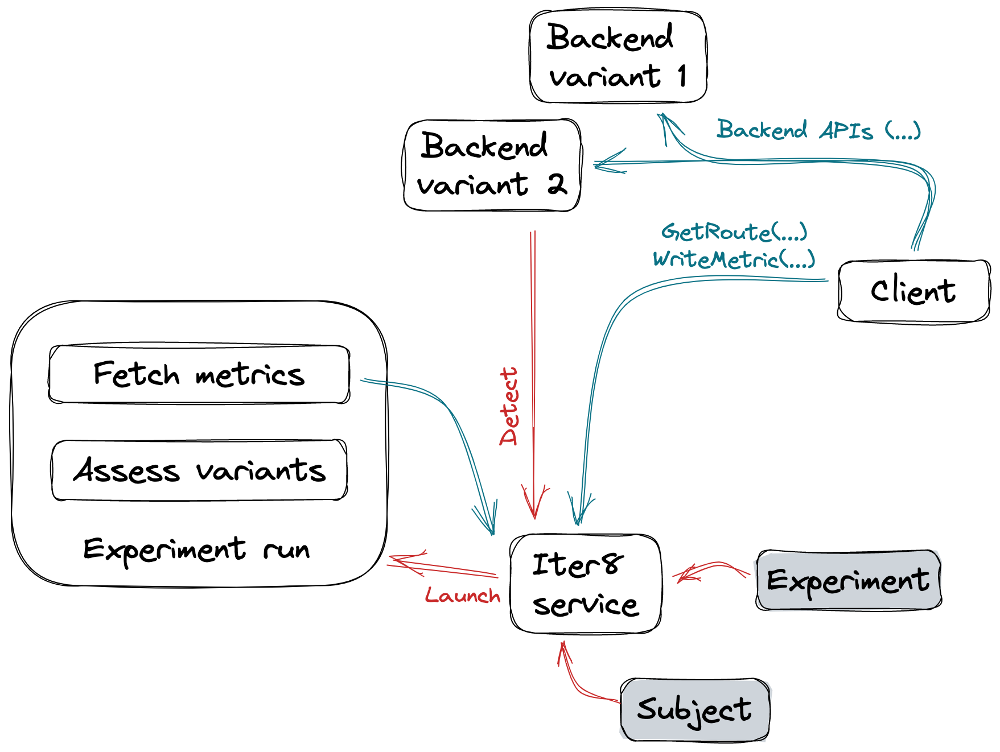

# Iter8 SDK

Iter8 provides an SDK for application developers to facilitate A/B/n testing of distributed Kubernetes applications. The SDK provides three [gRPC](https://grpc.io/) APIs, namely, `GetRoute`, `SetRoute`, and `WriteMetric`. [Iter8 service](service.md) provides the server-side implementation of these APIs. The client bindings for these APIs can be generated and used within a client written in [any gRPC supported language](https://grpc.io/docs/languages/).

## GetRoute

`GetRoute` takes as input [an app ID](appconf.md#app-id) and a user ID, and returns a [version number](../glossary.md#version-number). Its protobuf definition is as follows.

```proto
// GetRoute gets the version (number) for the given RequestMeta (appID/userID combination)
rpc GetRoute(RequestMeta) returns(Version) {}

// RequestMeta specifies an app and a user ID.
message RequestMeta {
  // app ID
  string app = 1;
  // user ID
  string user = 2;
}

message Version {
  // version number
  int32 number = 1;
}
```

### Illustration

A usage scenario for the `GetRoute` API is illustrated below. In this scenario, the application consists of a frontend component and a backend component. The backend is the app that is being A/B tested and has two versions. Whenever the frontend needs to send a request to the backend, it calls `GetRoute` to determine the backend version, and routes the backend request appropriately.


{: style="width:70%"}


### Guarantees

`GetRoute` provides the following three guarantees.

1. **Readiness**: The version returned by *Lookup* is guaranteed to be [ready](../glossary.md#readiness). This enables safe and error-free update or deletion of Kubernetes resources that are associated with app versions. Assuming at least one version of the app is ready, *Lookup* returns the `OK` status. If none of the app versions are ready, then *Lookup* returns an error status instead.

2. **Weighted routing**: Given an app, and a set of versions that are ready, the number of users mapped to a version is (approximately) proportional to its [weight](../glossary.md#weight).

3. **User stickiness**: Given an app, a set of versions that are ready, and a user, distinct *Lookup* calls for the user will return the same version. User stickiness is essential during A/B/n testing for correct attribution of metrics to versions and consistent end-user experience.

## SetRoute
`SetRoute` takes as input an app ID, a user ID, and a version number, and registers this route. Its protobuf definition is as follows.

```proto
// Report a route
rpc SetRoute(Route) returns (google.protobuf.Empty) {}

message Route {
  // app ID
  string app = 1;
  // user ID
  string user = 2;
  // version number
  int32 number = 3;
}
```

### Illustration

Two usage scenario for the `SetRoute` API are illustrated below.

=== "SetRoute called downstream"
    In this scenario, the application consists of a frontend component and a backend component. The backend is the app that is being A/B tested and has two versions. The request from the frontend to the backend are routed through a service mesh, proxy, or other  networking mechanism. Whenever the frontend sends a request to the backend, it calls `SetRoute` to report the route.

    {: style="width:90%"}

=== "SetRoute called by app"
    In this scenario, requests are routed to different versions of the app through a service mesh, proxy, or other networking mechanism. Whenever an app version receives a request, it calls `SetRoute` to report the route.

    {: style="width:75%"}

## WriteMetric
`WriteMetric` takes as input an app ID, a user ID, a [counter metric](../glossary.md#counter) name, and a metric value, and reports this 4-tuple to the Iter8 service. Its protobuf definition is as follows.

```proto
// Report a counter metric value
rpc WriteMetric(Counter) returns (google.protobuf.Empty) {}

message Counter {
  // metric name
  string metric = 1;
  // metric value
  double value = 2;
  // app ID
  string app = 3;
  // user ID
  string user = 4;
}
```

The `WriteMetric` API is illustrated as part of the [GetRoute](#illustration) and [SetRoute](#illustration_1) scenarios. 

## Usage examples

The client bindings for the Iter8 SDK APIs can be generated, embedded, and invoked within a client written in [any gRPC supported language](https://grpc.io/docs/languages/). The example code used in the [A/B testing tutorial](../../../tutorials/abn/abn.md) is in [this repo](https://github.com/iter8-tools/docs): you can refer to [frontend implementation](https://github.com/iter8-tools/docs/tree/main/samples/abn-sample/frontend) in [`Node`](https://github.com/iter8-tools/docs/tree/main/samples/abn-sample/frontend/node), [`Python`](https://github.com/iter8-tools/docs/tree/main/samples/abn-sample/frontend/python), and [`Go`](https://github.com/iter8-tools/docs/tree/main/samples/abn-sample/frontend/go).

### Generate client bindings
Our first step is to generate the client stub definitions from the [abn.proto](https://github.com/iter8-tools/iter8/blob/master/abn/grpc/abn.proto) file that defines the Iter8 SDK methods implemented by the Iter8 service.

=== "Node"
    The [gRPC Node.js library](https://grpc.io/docs/languages/node/basics/#loading-service-descriptors-from-proto-files) dynamically generates service descriptors and client stub definitions from `.proto` files loaded at runtime. So, there is nothing to do in this step.

=== "Python"
    Generate Python client bindings from [abn.proto](https://github.com/iter8-tools/iter8/blob/master/abn/grpc/abn.proto) as described [here](https://grpc.io/docs/languages/python/basics/#generating-client-and-server-code).

=== "Go"
    Generate Go client bindings from [abn.proto](https://github.com/iter8-tools/iter8/blob/master/abn/grpc/abn.proto) as described [here](https://grpc.io/docs/languages/go/basics/#generating-client-and-server-code). Place the generated files as part of a `go` package.

### Import client bindings

=== "Node"
    ```javascript
    var PROTO_PATH = '/the/path/to/abn.proto';
    var grpc = require('@grpc/grpc-js');
    var protoLoader = require('@grpc/proto-loader');
    // Suggested options for similarity to existing grpc.load behavior
    var packageDefinition = protoLoader.loadSync(
        PROTO_PATH,
        {keepCase: true,
        longs: String,
        enums: String,
        defaults: true,
        oneofs: true
        });
    var protoDescriptor = grpc.loadPackageDefinition(packageDefinition);
    // The protoDescriptor object has the full package hierarchy
    var abn = protoDescriptor.routeguide;
    ```

=== "Python"
    ```python
    import grpc
    import abn_pb2
    import abn_pb2_grpc    
    ```

=== "Go"
    ```go
    import (
        "google.golang.org/grpc"
        "google.golang.org/grpc/credentials/insecure"

        pb "the/package/containing/the/go/client/bindings"
    )
    ```

### Create stub

Suppose you have installed the Iter8 service in the `iter8-system` namespace. You can then create client stubs as follows.

=== "Node"
    ```javascript
    var stub = new abn.ABNClient(
        'iter8-service.iter8-system.svc.cluster.local:50051',
         grpc.credentials.createInsecure());
    ```

=== "Python"
    ```python
    channel = grpc.insecure_channel('iter8-service.iter8-system.svc.cluster.local:50051')
    stub = route_guide_pb2_grpc.RouteGuideStub(channel) 
    ```

=== "Go"
    ```go
    var opts []grpc.DialOption
    ...
    conn, err := grpc.Dial('iter8-service.iter8-system.svc.cluster.local:50051', opts...)
    if err != nil {
    ...
    }
    defer conn.Close()
    ```

### Invoke GetRoute

=== "Node"
    ```javascript
    const trackToRoute = {
        "backend":   "http://backend.default.svc.cluster.local:8091",
        "backend-candidate-1": "http://backend-candidate-1.default.svc.cluster.local:8091",
    }

    var application = new messages.Application();
    application.setName('default/backend');
    application.setUser(req.header('X-User'));
    client.lookup(application, function(err, session) {
        if (err || (session.getTrack() == '')) {
            // use default route (see above)
            console.warn("error or null")
        } else {
            // use route determined by recommended track
            console.info('lookup suggested track %s', session.getTrack())
            route = trackToRoute[session.getTrack()];
        }

        // call backend service using route
        ...
    });
    ```

=== "Python"

=== "Go"
    ```go
    trackToRoute = map[string]string{
        "backend":             "http://backend.default.svc.cluster.local:8091",
        "backend-candidate-1": "http://backend-candidate-1.default.svc.cluster.local:8091",
    }

    route := trackToRoute["backend"]
    user := req.Header["X-User"][0]
    s, err := (*client).Lookup(
        ctx,
        &pb.Application{
            Name: "default/backend",
            User: user,
        },
    )
    if err == nil && s != nil {
        r, ok := trackToRoute[s.GetTrack()]
        if ok {
            route = r
        }
    }

    // call backend service using route
    ...
    ```

### Invoke SetRoute

=== "Node"
    ```javascript
    var stub = new abn.ABNClient(
        'iter8-service.iter8-system.svc.cluster.local:50051',
         grpc.credentials.createInsecure());
    ```

=== "Python"
    ```python
    channel = grpc.insecure_channel('iter8-service.iter8-system.svc.cluster.local:50051')
    stub = route_guide_pb2_grpc.RouteGuideStub(channel) 
    ```

=== "Go"
    ```go
    var opts []grpc.DialOption
    ...
    conn, err := grpc.Dial('iter8-service.iter8-system.svc.cluster.local:50051', opts...)
    if err != nil {
    ...
    }
    defer conn.Close()
    ```

### Invoke WriteMetric

As an example, a single metric named *sample_metric* is assigned a random value between 0 and 100 and written.

=== "Node"
    ```javascript
    var mv = new messages.MetricValue();
    mv.setName('sample_metric');
    mv.setValue(random({min: 0, max: 100, integer: true}).toString());
    mv.setApplication('default/backend');
    mv.setUser(user);
    ```

=== "Python"

=== "Go"
    ```go
    _, _ = (*client).WriteMetric(
        ctx,
        &pb.MetricValue{
            Name:        "sample_metric",
            Value:       fmt.Sprintf("%f", rand.Float64()*100.0),
            Application: "default/backend",
            User:        user,
        },
    )
    ```
